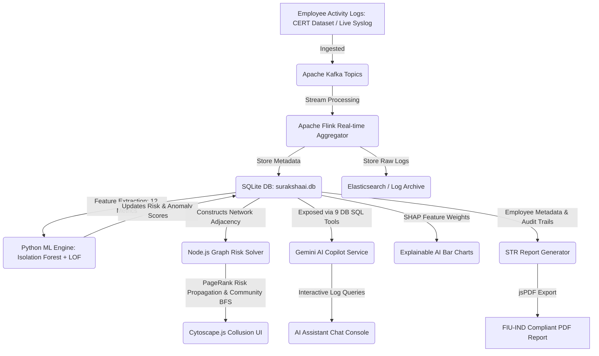

# SurakshaAI — AI-Driven Early Warning System for Internal & Privileged User Fraud

This document serves as the complete technical brief, architectural manual, and feature walkthrough for **SurakshaAI**, designed for presentation to the hackathon judges at **iDEA 2.0 (Union Bank of India)**.

---

## 📌 Project Overview & Elevator Pitch

Traditional banking security focuses heavily on external threats (firewalls, WAFs, DDoS protection). However, the most devastating financial and reputational losses stem from **Insider Threats**—employees, vendors, or privileged IT administrators who abuse their access.

**SurakshaAI** is a comprehensive internal fraud detection system that monitors employee activities across core banking systems, loan origination modules, and databases. It shifts the paradigm from reactive audits to **proactive, real-time warning signals** by combining:
1. **Behavioral Machine Learning (Ensemble Outlier Detection)** to spot subtle behavioral deviations.
2. **Graph Neural Networks & Risk Propagation Algorithms** to detect collusion networks and multi-party fraud rings.
3. **Generative AI Copilot (Gemini with Database Tools)** to allow investigators to query log history, summarize audit trails, and audit records in natural language.
4. **Regulatory Automated Reporting** for rapid Suspicious Transaction Report (STR) submission.

---

## 📊 Technical Architecture & Project Flow



### The System Flow in Action:
1. **Log Ingestion**: Continuous transactions, system logins, database queries, and file access actions are logged.
2. **ML Profiling**: The ML engine pulls events, extracts behavioral features (e.g. off-hours access, volume spikes), and detects statistical anomalies using a double-algorithm ensemble (Isolation Forest + LOF).
3. **Graph Collusion Analysis**: Relationship edges (shared beneficiary accounts, supervisor approvals, system proximity) are processed. Risk is propagated from high-risk nodes to neighboring nodes.
4. **CISO Alerting**: High-risk outliers appear on the dashboard. Explainable SHAP charts identify the exact risk variables.
5. **Interactive Investigation**: The investigator uses the Gemini chatbot to dig deeper ("What files did this user download during off-hours?").
6. **Regulatory Filing**: The investigator clicks "Export STR" to immediately generate a PDF formatted to RBI and FIU-IND compliance standards.

---

## 🗄️ The Dataset: Source, Schema & Adaptations

### 1. Primary Source: CMU CERT Insider Threat Dataset
For training and evaluation, SurakshaAI leverages structure modeled after the **CMU CERT Insider Threat Dataset (R4.2)**—the gold standard in cybersecurity research for insider threat detection.
- **Data Types Used**:
  - `Logins/Logouts`: Timestamps, machines, and network domains.
  - `Devices`: USB insert/remove events (bulk data copy indicators).
  - `File Actions`: Read/write/delete events on sensitive core systems.
  - `HTTP Activity`: Access to unauthorized sites or suspicious file uploads.

### 2. SQLite Relational Schema (`surakshaai.db`)
The database contains the following tables:
- **`employees`**: Metadata (ID, name, email, department, role, status, risk score).
- **`activity_events`**: Detailed log lines (ID, employee_id, action_type, system, risk_contribution, description, timestamp).
- **`behavioral_data`**: Aggregated daily stats (employee_id, date, anomaly_score, volume_score, off_hours_ratio, usb_activity_count, login_failures, data_exfiltration_risk).
- **`collusion_edges`**: Network links (source employee, target employee, interaction_type, strength, timestamp).
- **`shap_values`**: Explanations (employee_id, feature, weight).
- **`audit_trail`**: Actions taken by investigators (employee_id, investigator, action, details, timestamp).

### 3. Adding New / Custom Data
To inject new log data into the system, developers/CISO teams can:
- **Seed Script**: Edit `server/db/seed.js` to modify the initial simulated database state.
- **REST Ingestion API**: Send post requests to the ingestion endpoints to simulate streaming traffic in real-time.
  - `POST /api/pipeline/ingest/event`: Ingests a new raw activity event and updates the live metrics.
  - `POST /api/pipeline/ingest/edge`: Adds a new interaction node link to the collusion network.

---

## 🚀 Detailed Feature Walkthrough

### 1. CISO Real-Time Data Pipeline Monitor
- **Why this feature?**
  Judges ask: *"How does this scale to handle millions of logs a day?"* The Pipeline Monitor shows that SurakshaAI is built for enterprise-grade big-data architectures. It visualizes the health, throughput, and consumer lag of the ingestion pipeline.
- **Implementation**:
  - The backend (`server/routes/pipeline.js`) returns metrics representing Apache Kafka topics, Apache Flink stream workers, Elasticsearch clusters, and PostgreSQL connection pools.
  - The client (`PipelineMonitorPage.tsx`) queries this API every 10 seconds, drawing area charts using Recharts and warning operators if consumer lag grows.
- **How it works**:
  It computes simulated real-time event rates (fluctuating around 12,000 events/sec with occasional random load spikes) and monitors consumer lags. If lag climbs, status badges turn from green to warning orange or red.

### 2. Behavioral Anomaly Detection Engine (Python ML)
- **Why this feature?**
  Traditional security uses static rules (e.g. "flag if login fails 3 times"). Rogue employees bypass rules by spacing out actions. Behavioral ML looks at statistical deviations in user-specific baseline habits.
- **Implementation**:
  - **Script**: `server/ml/anomaly_detector.py`
  - **Models**:
    - **Isolation Forest**: Isolates anomalies by randomly selecting features and splitting values. Outliers require fewer splits to isolate.
    - **Local Outlier Factor (LOF)**: Computes the local density of a node relative to its neighbors, catching anomalies clustered near normal points.
    - **Ensemble**: Combines scores (60% IF + 40% LOF) to create a robust risk rating.
  - **12 Behavioral Features Extracted per Employee**:
    1. Total transaction/log actions.
    2. Count of unique systems accessed.
    3. Diversity of action types (Shannon entropy).
    4. Off-hours action ratio (outside 9AM - 6PM).
    5. Weekend activity ratio.
    6. Average event risk contribution.
    7. Peak event risk contribution.
    8. Count of high-risk actions.
    9. Action patterns diversity.
    10. Target systems diversity.
    11. Temporal burst score (peak hourly events / average).
    12. Cross-department access ratio.
- **How it works**:
  The script connects to the database, extracts events, fits the ensemble model, generates anomaly scores, and blends them with existing database metrics to write back updated risk scores.

### 3. Graph Risk Propagation & Collusion Scan
- **Why this feature?**
  Insiders rarely commit fraud alone. They often cooperate—for example, a Treasury officer transferring funds to a Loan officer who approves a fraudulent bypass.
- **Implementation**:
  - **Script**: `server/routes/collusion.js`
  - **Algorithms**:
    - **Adjacency graph construction** from database links.
    - **Risk Propagation**: A PageRank-inspired iterative formula: `NewRisk = Max(OwnRisk, Max(NeighborRisk * EdgeWeight * Decay)`.
    - **Betweenness Centrality (Brandes' Algorithm)**: Identifies bridge employees acting as conduits between departments.
    - **Clustering Coefficient**: Computes local triangle structures indicating tightly-knit conspiracy rings.
    - **BFS Community Detection**: Groups interconnected nodes with average risks above 70% into flagged fraud rings.
- **How it works**:
  Clicking "Run Collusion Scan" on the Collusion Graph dashboard triggers this solver. It recalculates the graph parameters on the fly, updates SQLite, and renders the colored rings via Cytoscape.js.

### 4. SHAP Explainable AI (XAI) Dashboard
- **Why this feature?**
  CISO investigators will ignore AI alerts if they don't understand them. The system must explain *why* an employee is flagged to build trust and prevent investigation fatigue.
- **Implementation**:
  - SHAP (SHapley Additive exPlanations) values are generated (pre-seeded/ML-derived) mapping how much each behavioral feature added to or subtracted from the baseline risk score.
  - These weights are rendered on the employee details view as horizontal bar graphs.
- **How it works**:
  If a user has a risk score of 82, the SHAP card explains that `+35` was added due to "Data download volume spikes" and `+20` due to "Off-hours operations", while normal "Login location" subtracted `-5`.

### 5. AI Copilot (Gemini with Database Tool Calling)
- **Why this feature?**
  Investigators spend hours looking up databases, tracing connections, and typing SQL queries. The Gemini assistant lets them query the raw database logs in natural language.
- **Implementation**:
  - **Script**: `server/services/geminiService.js` and `server/routes/chat.js`
  - **API**: Google Gemini SDK using a function-calling loop.
  - **9 Registered Database Tools (SQL wrappers)**:
    - `getEmployeeDetails(id)`
    - `getEmployeeByName(name)`
    - `getRecentActivity(id, limit)`
    - `getAlertsByEmployee(id)`
    - `getHighRiskEmployees(threshold)`
    - `getCollusionLinks(id)`
    - `getDepartmentSummary(dept)`
    - `getRecentAlerts(limit, severity)`
    - `getAuditTrail(id, limit)`
- **How it works**:
  The investigator type: *"Show me the activities of Sneha Patel over the last 24 hours"*. The system passes the request to Gemini. Gemini identifies that it needs to call `getEmployeeByName(name: "Sneha Patel")`, receives the employee ID `EMP-2217`, automatically initiates a second call to `getRecentActivity(employeeId: "EMP-2217")`, and prints the formatting logs.

### 6. Regulatory STR Exporter
- **Why this feature?**
  Under RBI guidelines, suspicious events must be reported to the Financial Intelligence Unit (FIU-IND) within 7 days. Automating the report creation saves days of paperwork.
- **Implementation**:
  Uses client-side `jsPDF` configured with Indian banking templates, drawing structural tables for Employee Profile, Risk Indicators, Activity Audits, and Investigator Sign-off.

---

## 💻 How to Run the Project

### Prerequisites
- **Node.js**: v18 or later.
- **Python**: v3.8 or later (for running ML calculations).

### Step 1: Install Dependencies
Run the installation script in the root directory to install client, server, and root package dependencies:
```bash
npm run install:all
```

To install the Python machine learning library requirements:
```bash
cd server
pip install -r ml/requirements.txt
cd ..
```

### Step 2: Seed the Database
Initialize the SQLite database with the simulated CERT dataset and default profiles:
```bash
npm run seed
```

### Step 3: Run the Machine Learning Anomaly Detector (Optional)
Run the scikit-learn models on the database to verify the ML scores are generated:
```bash
cd server
python ml/anomaly_detector.py
cd ..
```

### Step 4: Start the Application
Run the root development command to launch the client (Vite) and backend (Express) concurrently:
```bash
npm run dev
```

- **Frontend App**: Accessible at **[http://localhost:5174](http://localhost:5174)** (or `5173` if vacant).
- **Backend API**: Running on **[http://localhost:3001](http://localhost:3001)**.

### Credentials for Demo
Login to the app using:
- **Role**: CISO / Investigator
- **Username**: `ciso@unionbank.in`
- **Password**: `password123`
